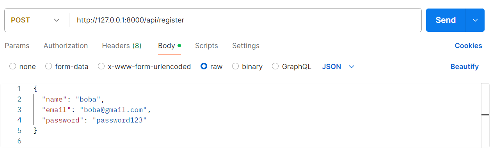
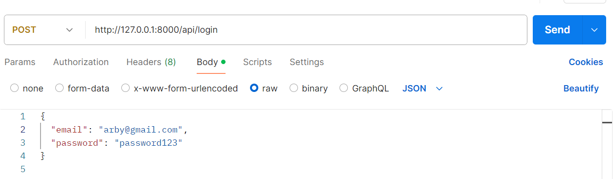
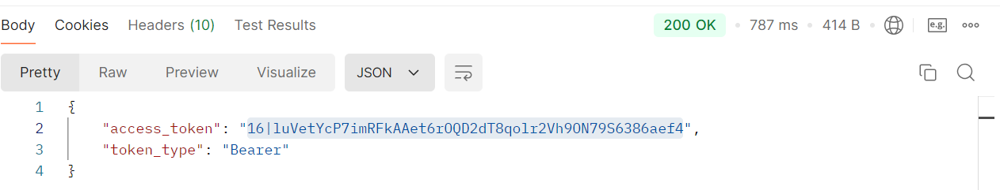
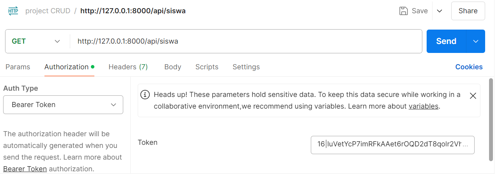
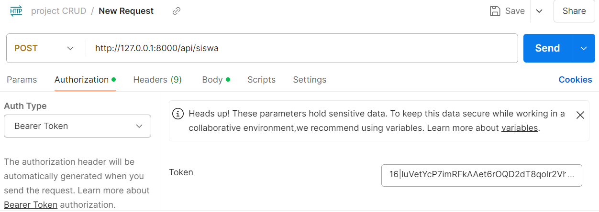
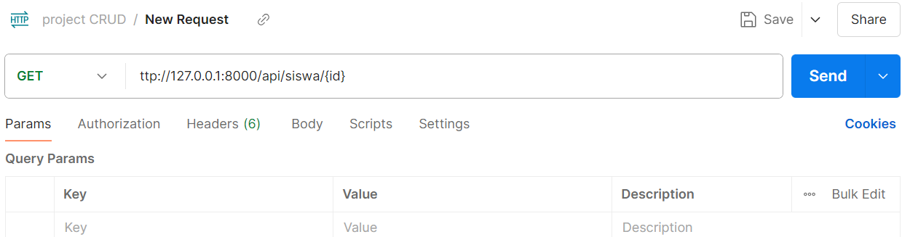
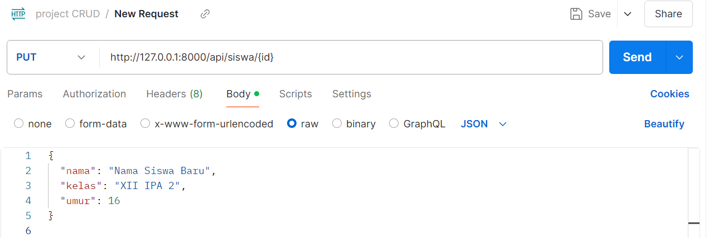
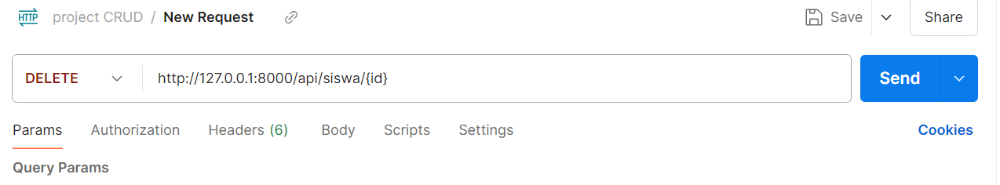
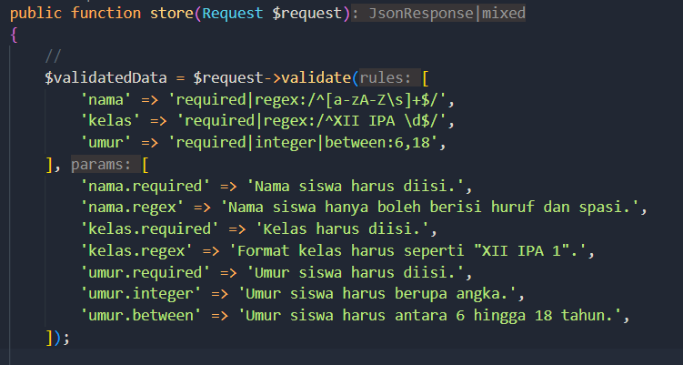

NAMA : MOH. ARBI ARDIANSYAH

NIM : 362358302150

KELAS : 2B TRPL

                                             API Autentikasi dan CRUD Data Siswa
                                                     dengan Laravel 10

1. Pengujian Register

Hasil:

2. Pengujian Login

Hasil:

3. Pengujian CRUD Data Siswa

a.

b.

c.

d.

e.

4.Tugas Tambahan: Validasi Input Lebih Kompleks

